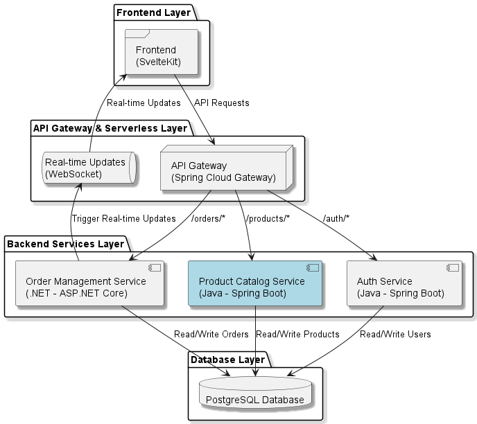
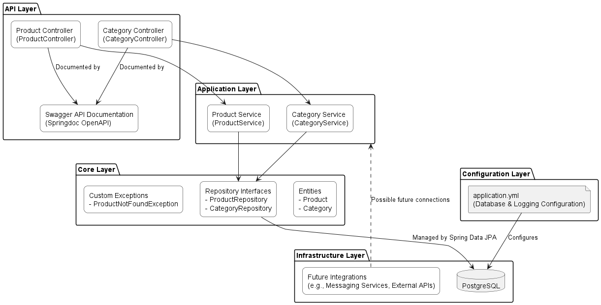
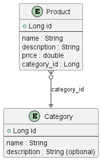

# ProductCatalogService

### Software Architecture Overview

The diagram below illustrates the layered architecture of the **Product Service** as part of an e-commerce platform. The architecture follows an **Onion Architecture** approach, ensuring the separation of concerns and promoting modularity and scalability. Each layer has a distinct role and interacts with the adjacent layers through well-defined interfaces.



## Project Description
`ProductCatalogService` is a microservice built with **Spring Boot** that manages the product catalog in an e-commerce platform. The project follows a layered architecture and is designed to be scalable and maintainable, utilizing modern tools and patterns within the **Java** and **Spring** ecosystem.


## Clean Architecture




The architecture is organized into multiple layers, each with a specific purpose:

1. **API Layer**: Manages HTTP requests and maps them to the corresponding services. It uses Spring controllers (`@RestController`) to handle CRUD operations and respond in JSON format.

2. **Application Layer**: Contains the business logic through services that interact with repositories and entities. This layer acts as an intermediary between the API layer and the infrastructure layer.

3. **Core Layer**: Defines the domain entities and repository interfaces, ensuring independence from the persistence infrastructure. It also contains custom exceptions to handle domain-specific errors.

4. **Infrastructure Layer**: Provides concrete implementations for the repositories using Spring Data JPA, managing the interaction with the PostgreSQL database configured in the application.

5. **Configuration Layer**: Includes application-specific configuration such as database setup and logging management using YAML files.

## Dependencies Used

The main dependencies of the project are:

- **Spring Boot Starter Data JPA**: Integration with JPA for interacting with relational databases using Hibernate.
- **Spring Boot Starter Web**: Allows the creation and exposure of RESTful services.
- **PostgreSQL**: JDBC driver to connect to the PostgreSQL database.
- **Lombok**: Reduces code verbosity by providing annotations to generate constructors, getters, setters, among others.
- **MapStruct**: Framework for mapping entities and DTOs, simplifying data conversion between layers.
- **Springdoc OpenAPI**: Generates interactive API documentation based on OpenAPI 3 specifications.

## Design Patterns Used

- **Repository Pattern**: Spring Data JPA abstracts database operations, allowing interaction with the database through repository interfaces without dealing directly with SQL queries.
- **DTO (Data Transfer Object)**: Separates internal domain entities from the external representation, ensuring security and flexibility.
- **Mapper Pattern**: MapStruct is used to convert entities to DTOs and vice versa, ensuring clean and efficient data mapping.

## How to Run

1. Ensure you have **PostgreSQL** installed and running.
2. Clone the repository.
3. Configure the database connection in the `application.yml` file as needed.
4. Build the project using Maven:
   ```bash
   mvn clean install
   ```
5. Run the application:
   ```bash
   mvn spring-boot:run
   ```
6. Access the API documentation at [http://localhost:8090/swagger-ui/index.html](http://localhost:8090/swagger-ui/index.html).

## Testing

The project includes both unit and integration tests using **JUnit** and **Mockito**. To run the tests:
```bash
mvn test
```

## Database Configuration



The database is configured using JPA and the following properties in the `application.yml`:

```yaml
spring:
  datasource:
    url: jdbc:postgresql://localhost:5432/testpsql
    username: userName
    password: pswwd
    driver-class-name: org.postgresql.Driver
  jpa:
    hibernate:
      ddl-auto: update
    show-sql: true
    database-platform: org.hibernate.dialect.PostgreSQLDialect
```

Ensure the database is set up correctly before running the application.

## Logging Configuration

Logs are configured to output to both the console and a file located at `logs/application.log`.

```yaml
logging:
  file:
    name: logs/application.log
  level:
    root: DEBUG
    org.springframework: INFO
    org.springframework.web: DEBUG
```

## Future Improvements

- Implement Flyway for better database migration management.
- Add caching mechanisms to optimize read operations.
- Expand the test suite with more integration tests.

## Author
Developed by John Cubides.

